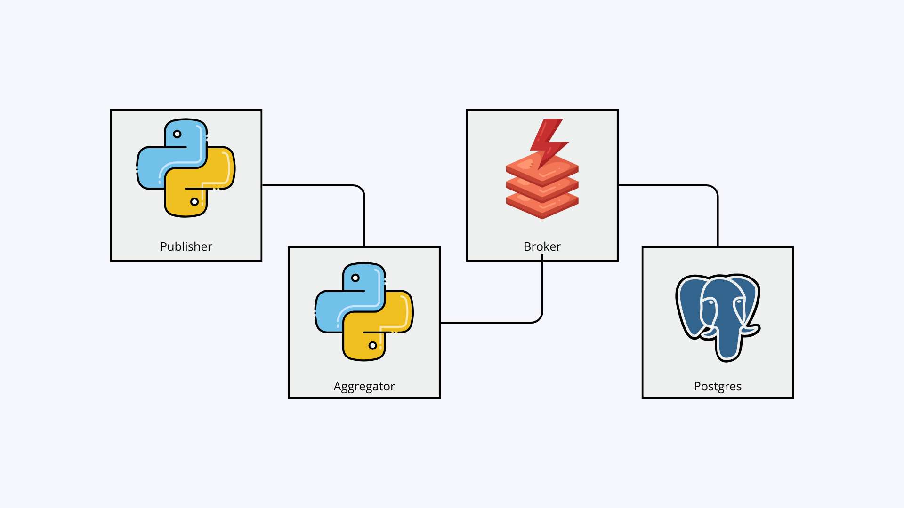

# Distributed Pub-Sub Log Aggregator

Sistem log aggregator terdistribusi dengan fitur **idempotent processing**, **strong deduplication**, dan **transaction/concurrency control** menggunakan Docker Compose.

## 📋 Gambaran Umum

Sistem ini mengimplementasikan:
- ✅ **Publish-Subscribe Pattern** dengan Redis sebagai message broker
- ✅ **Idempotent Consumer** - event tidak diproses ulang meski diterima berulang kali
- ✅ **Strong Deduplication** - deteksi duplikat berbasis unique constraint di PostgreSQL
- ✅ **Transaction & Concurrency Control** - menggunakan `INSERT...ON CONFLICT` untuk mencegah race condition
- ✅ **Data Persistence** - data aman meski container dihapus (named volumes)
- ✅ **Multi-Worker Consumers** - concurrent processing tanpa duplikasi
- ✅ **REST API** - untuk publish event dan query data

## 🏗️ Arsitektur



### Komponen

1. **Aggregator Service** (Python/FastAPI)
   - REST API: `POST /publish`, `GET /events`, `GET /stats`, `GET /health`
   - 3 consumer workers yang memproses event dari Redis queue
   - Idempotent processing dengan PostgreSQL transaction

2. **Publisher Service** (Python)
   - Mensimulasikan event generator
   - Mengirim 20,000 events dengan 35% duplikasi
   - Rate limiting untuk realistic simulation

3. **Redis Broker**
   - Message queue untuk at-least-once delivery
   - Persistence dengan AOF (append-only file)

4. **PostgreSQL Storage**
   - Menyimpan event data dan dedup store
   - Unique constraint untuk `(topic, event_id)`
   - ACID transactions dengan isolation level READ COMMITTED

##  Quick Start

### Prerequisites

- Docker & Docker Compose
- Git

### 1. Clone Repository

```bash
git clone <repository-url>
cd uasSister
```

### 2. Build & Run

```bash
docker compose up --build
```


### 3. Akses API

Aggregator API tersedia di `http://localhost:8080`

#### Cek Health

```bash
curl http://localhost:8080/health
```

#### Cek Statistics

```bash
curl http://localhost:8080/stats
```

Response:
```json
{
  "received_total": 20000,
  "unique_processed": 13000,
  "duplicate_dropped": 7000,
  "active_topics": 10,
  "uptime_seconds": 125.5,
  "started_at": "2023-12-06T10:00:00",
  "last_updated": "2023-12-06T10:02:05"
}
```

#### Query Events

```bash
# Semua events
curl "http://localhost:8080/events"

# Filter by topic
curl "http://localhost:8080/events?topic=user.login"

# Limit hasil
curl "http://localhost:8080/events?topic=order.created&limit=10"
```

#### Publish Event Manual

```bash
curl -X POST http://localhost:8080/publish \
  -H "Content-Type: application/json" \
  -d '{
    "topic": "test.manual",
    "event_id": "manual_001",
    "timestamp": "2023-12-06T10:00:00Z",
    "source": "curl",
    "payload": {"message": "Test event"}
  }'
```

## Testing

### Prerequisites

- **Python 3.11** (required)
- Docker & Docker Compose (tests run against live containers)

### Setup Test Environment

```bash
# Create virtual environment with Python 3.11
python3.11 -m venv venvtest
source venvtest/bin/activate

# Install test dependencies
pip install -r tests/requirements.txt
```

### Run Tests

```bash
# 1. Start Docker containers (required!)
sudo docker compose up -d storage broker aggregator

# 2. Wait for healthy status
sudo docker compose ps

# 3. Run all tests
pytest -v tests/

# Run specific test file
pytest tests/test_idempotency.py -v

# Run with coverage
pytest tests/ --cov=aggregator --cov-report=html
```

> **Note**: Tests connect to PostgreSQL (port 5432) and Redis (port 6379) running in Docker. Make sure containers are healthy before running tests.

### Test Categories

1. **test_idempotency.py** - Idempotency tests
   - Duplicate detection
   - Topic+event_id uniqueness
   - Stats updates

2. **test_concurrency.py** - Concurrency control tests
   - Race condition prevention
   - Multiple workers processing same event
   - Stats consistency under load

3. **test_persistence.py** - Data persistence tests
   - Dedup store survival across restarts
   - Event data persistence
   - Query functionality

## Key Features

### 1. Idempotent Processing

Event dengan `(topic, event_id)` yang sama hanya diproses sekali, meski diterima berkali-kali.

**Implementation:**
```python
# Insert ke dedup store dengan ON CONFLICT
INSERT INTO processed_events (topic, event_id)
VALUES ($1, $2)
ON CONFLICT (topic, event_id) DO NOTHING
RETURNING id
```

Jika conflict → duplikat terdeteksi, event di-skip.

### 2. Transaction & Concurrency Control

Semua operasi (dedup check, event insert, stats update) dilakukan dalam **satu transaksi**:

```python
async with conn.transaction():
    # 1. Coba insert ke dedup store
    result = await conn.execute("INSERT ... ON CONFLICT DO NOTHING")
    
    # 2. Jika berhasil, insert event data
    if not conflict:
        await conn.execute("INSERT INTO events ...")
        
    # 3. Update statistik
    await conn.execute("UPDATE stats SET ...")
```

**Isolation Level:** READ COMMITTED
- Cukup untuk mencegah dirty reads
- Unique constraint sudah handle race condition
- Performa lebih baik dibanding SERIALIZABLE

### 3. Data Persistence

- **PostgreSQL**: Named volume `uas_pg_data` di `/var/lib/postgresql/data`
- **Redis**: Named volume `uas_broker_data` untuk AOF file

Data tetap ada meski container dihapus:
```bash
docker compose down    # Stop & remove containers
docker compose up      # Data masih ada!
```

## 📁 Project Structure

```
uasSister/
├── docker-compose.yml          # Docker Compose configuration
├── aggregator/
│   ├── Dockerfile
│   ├── requirements.txt
│   ├── init.sql                # Database schema
│   ├── main.py                 # FastAPI app + consumers
│   ├── models.py               # Pydantic models
│   ├── database.py             # Database layer
│   └── consumer.py             # Redis consumer workers
├── publisher/
│   ├── Dockerfile
│   ├── requirements.txt
│   └── main.py                 # Event generator
├── tests/
│   ├── requirements.txt
│   ├── conftest.py             # Test fixtures
│   ├── test_idempotency.py
│   ├── test_concurrency.py
│   └── test_persistence.py
└── README.md
```

## 🔧 Configuration

Environment variables dapat di-set di `docker-compose.yml`:

### Aggregator
- `DATABASE_URL`: PostgreSQL connection string
- `REDIS_URL`: Redis connection string
- `NUM_WORKERS`: Number of consumer workers
- `LOG_LEVEL`: Logging level 

### Publisher
- `TARGET_URL`: Aggregator publish endpoint
- `REDIS_URL`: Redis connection string
- `TOTAL_EVENTS`: Total events to generate
- `DUPLICATE_RATE`: Percentage of duplicates
- `SEND_RATE`: Events per second

## 📈 Performance Metrics

Sistem diuji dengan:
- **20,000 total events**
- **35% duplicate rate** (~7,000 duplicates)
- **100 events/second** send rate


### Port sudah digunakan
```bash
# Check process using port 8080
sudo lsof -i :8080

# Edit docker-compose.yml untuk ganti port
ports:
  - "8081:8080"
```

### Database connection error
```bash
# Check database container
docker compose ps storage

# View database logs
docker compose logs storage

# Restart database
docker compose restart storage
```

### Events tidak diproses
```bash
# Check consumer logs
docker compose logs aggregator

# Check Redis queue size
docker compose exec broker redis-cli LLEN events_queue
```

### Clean restart
```bash
# Stop dan remove semua (including volumes)
docker compose down -v

# Build dan start ulang
docker compose up --build
```

## 🎥 Demo & Report

### Video Demo
https://youtu.be/sp_Zhv_9JWw

### Laporan Proyek
[report.md](report.md)
